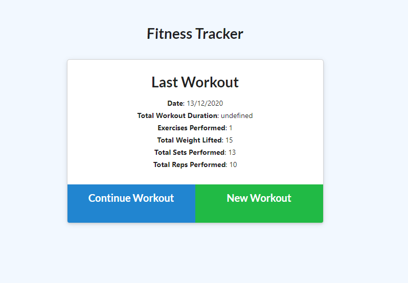
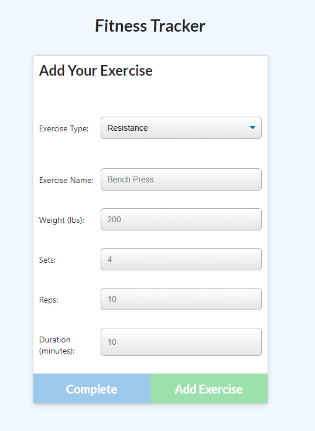

# Workout Tracker #

## Description ##

As a user, I want to be able to view create and track daily workouts. I want to be able to log multiple exercises in a workout on a given day. I should also be able to track the name, type, weight, sets, reps, and duration of exercise. If the exercise is a cardio exercise, I should be able to track my distance traveled.

## Images ##

## Installation ##

Run the npm init & npm install commands in the command line before use.

## Links ##

Github: https://github.com/Callumwhite210/homeworkweek17
Heroku: https://quiet-sierra-01511.herokuapp.com/